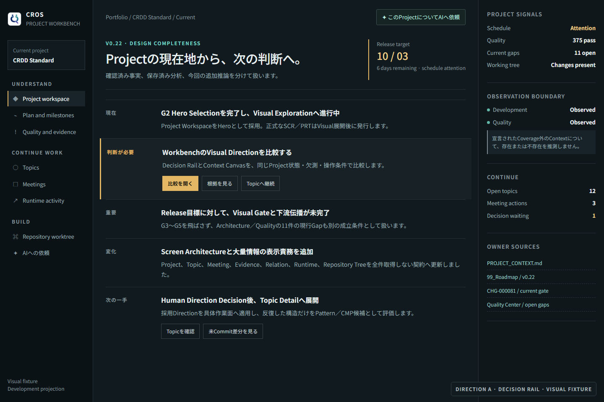
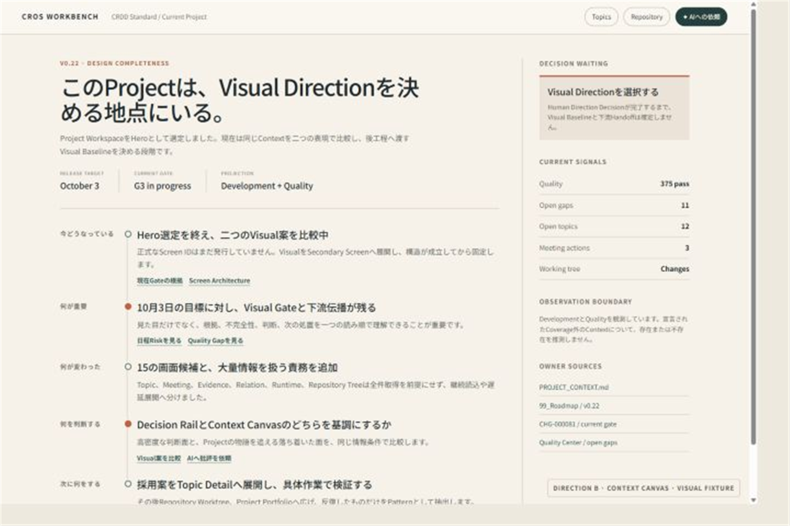

# Workbench Visual Exploration

成果物種別: UI Detail — Visual Exploration
対象Product: CROS Workbench
対象Hero: Project Workspace
状態: Revalidated — G3／G4／G5 Passed
維持責任者: Qual-Lab

## 1. 目的

G2で採用したProject Workspaceについて、同じ情報責務と表示条件を維持した複数のVisual Directionを実物で比較する。文章による雰囲気名だけをVisual案として扱わず、再現可能なHTML SourceとRendered Viewを一組にする。

## 2. 固定表示条件

| 条件 | 両Directionで保持する内容 |
|---|---|
| Project | v0.22 Design Completeness |
| 期限 | 10月3日目標 |
| 現在 | G2完了、G3 Visual Exploration進行中 |
| 重要 | Visual Gate、現在のChecker Gap、Project Contextの不完全性 |
| 変化 | Screen ArchitectureとHero選定を更新 |
| 判断 | Visual Directionの選択が必要 |
| 次 | Secondary Screen展開 |
| Topic／Meeting | 継続Topicと未処置Actionへの入口 |
| Quality | PassとOPEN／Gapを同時表示 |
| Repository | 未Commit差分の存在だけを概要表示 |
| AI | Context付き依頼入口。会話履歴を主役にしない |

実値を主張する成果物ではなく、Visual比較用Fixtureである。各Directionを有利にするために情報量、欠測、Attentionまたは操作の有無を変えない。

## 3. Direction比較

| Direction | Intent | 主なComposition | 強み | Trade-off | 保持するUX／IA | 状態 |
|---|---|---|---|---|---|---|
| A — Decision Rail | 判断待ちと次の一手を中心軸に置く高密度な運用面 | 左Navigation、中央Decision Stream、右Evidence Rail | Attentionから根拠・処置へ速く進める | 情報量が多く、Developer／運用監視へ寄って見えやすい | 五場面、根拠、不完全性、次行動 | Rendered |
| B — Context Canvas | Projectの物語と現在地を読み順で理解する落ち着いた作業面 | 上部Project Header、中央Narrative、右Context Dock | 状況理解と変化の把握が自然 | 直接操作と高密度監視への到達感が弱い | 五場面、Relation、Attention、次行動 | Rendered |

## 4. Visual SourceとRendered View

| Direction | Visual Source | Rendered View | Render条件 |
|---|---|---|---|
| A | [Decision Rail HTML](Visual/workbench-hero/direction-a.html) | [Decision Rail PNG](Visual/workbench-hero/direction-a.png) | 1440 × 960、100% |
| B | [Context Canvas HTML](Visual/workbench-hero/direction-b.html) | [Context Canvas PNG](Visual/workbench-hero/direction-b.png) | 1440 × 960、100% |

### Direction A — Decision Rail

### Direction B — Context Canvas

## 5. 実画像による比較

| 観点 | A — Decision Rail | B — Context Canvas | AI評価 |
|---|---|---|---|
| Composition | Navigation、判断Stream、Evidence Railの三列 | NarrativeとContext Dockの二列 | Aは作業分離、Bは理解の連続性が強い |
| Information Density | 高い。主要状態と入口を同時に走査できる | 中程度。余白と読み順を優先 | 日常運用はA、初見理解はBが優位 |
| Visual Hierarchy | 判断待ちを色と面で強調 | 大見出しと時系列上のAttentionで強調 | BのProject Identityが強く、Aの処置優先度が明確 |
| Attention | Railと中央の強調区画へ集約 | Narrative上の赤い節点と右上Decisionへ分散 | Aの方が即時判断に速い。Bは理由と文脈を保つ |
| Reading Order | 左Navigationから中央、必要時に右Rail | Project概要から五場面を上から読み、右Dockで補完 | 五場面の物語性はBが明確 |
| Action Hierarchy | 主要・副次Actionを明示しやすい | Link中心で、実行面としては弱い | Aを運用Modeへ保持する価値がある |
| Role Bias | Developer／Operator寄り | PM／Managementを含め理解しやすい | Product共通BaselineはBが安全 |
| AIへの依頼 | NavigationとHeaderに補助入口 | Headerの補助入口 | どちらもChat履歴を主役にしていない |
| Gitの扱い | Navigationと概要から到達 | Headerの補助入口から到達 | どちらもHeroの主役にしていない |
| 不完全性・根拠 | 右Railへ常時表示 | Context Dockへ常時表示 | 両案とも保持 |

### Visual Design Principle再評価

初回比較後、両案がFont FamilyとVisual Tasteは示していても、8〜11pxの文字、未Token化のType Scale、操作対象、Contrast、狭幅およびKeyboard FocusをGate条件として評価していないことを検出した。これはG3の適格性不足であり、人間の好みで受容する対象ではないため、Rule、Template、CheckerおよびVisual Sourceを是正して再描画した。

| 観点 | 初回 | 是正後 | 根拠 |
|---|---|---|---|
| Type Scale | FAIL: 8〜11pxが常用されていた | PASS | 12／13／14／16／18／24／30px Token |
| 日本語本文 | FAIL: 10〜12px中心 | PASS | 本文14px、補助情報12pxを下限とした |
| Contrast | OPEN: 見た目だけで判定 | PASS | 通常幅5画面の可視文字351要素を測定し、4.5:1未満0件。明暗両SurfaceのFocus Outlineも3:1以上 |
| 操作対象 | FAIL: 24px前後のButtonがあった | PASS | 通常幅・720px幅の各75操作要素で32px未満0件 |
| 狭幅／実Browser Zoom | FAIL: `min-width: 1180px`で横Scrollのみ | PASS | 5画面を320〜1920 CSS pxで再配置し、さらに専用Chrome Profileで100%／200%／400%を実測した。全条件で横Overflow 0件、12px未満0件 |
| Keyboard Focus | OPEN | PASS | 5画面で正の`tabindex` 0件。DOM順と視覚順を揃え、`:focus-visible`を2px Outlineで明示した |

是正後のA／Bは同じFont Stack、Type Scaleおよび操作対象下限で再描画した。G4のDirection A採用はVisual Tasteの判断として維持できる。

AIは、`B — Context Canvas`をProduct共通のVisual Baseline候補とし、`A — Decision Rail`のNavigation、明確な主要Action、状態密度をDeveloper／Operator向けの作業Modeへ組み合わせる案を推奨した。Bだけでは実作業への移行が弱く、AだけではWorkbenchが運用監視Dashboardに見えやすいためである。

## 6. Human Direction Decision

- 判断者: Qual-Lab
- AI推奨: Bを基調とし、AのNavigation、主要Action、作業状態密度を組み合わせる
- 採用／組合せ／却下: `A — Decision Rail`を採用
- 判断理由: Qual-Labは2026-09-27に、WorkbenchのVisual TasteとしてAが適することを確認した。G5ではAの暗色・高密度・判断優先の基調を維持し、Bを共通Baselineとして混在させない
- 再探索条件: 両案ともProjectの現在地から判断・次の一手へ進めない、または一般的Dashboard／Chat／Git Clientへ見える場合

## 7. 未確認事項・戻り条件

| 項目 | 状態 | Owner | 影響 | 戻り条件／再評価契機 |
|---|---|---|---|---|
| Rendered View | 解決済み | Qual-Lab | G3通過 | Sourceまたは表示条件が変わった時に再描画する |
| Direction比較 | 解決済み | Qual-Lab | G4へ進める | 比較条件または上流の意味が変わった時 |
| Human Direction | 解決済み | Qual-Lab | AをG5の展開基準にする | Secondary ScreenでAの基調が利用者成果を阻害した場合 |
| Secondary Screen Expansion | 解決済み | Qual-Lab | AをWorkbench Visual Baselineとする | [Secondary Screen Expansion](05_Workbench_Secondary_Expansion.md)で記録した戻り条件が成立した場合 |

## Checklist

- [x] G2で人間が採用したHeroを使用した
- [x] 両Directionの情報責務と表示条件を固定した
- [x] 各DirectionのIntent、Composition、強み、Trade-off、保持するUX／IAを示した
- [x] 2案以上の再現可能なVisual Sourceを用意した
- [x] 同じViewportで2案以上を描画した
- [x] 情報階層、Attention、密度、Reading OrderおよびAction Hierarchyを比較した
- [x] G4の人間判断前にVisual BaselineをCanonical化していない
- [x] AI推奨と異なる人間判断を、その理由および保持する基調とともに記録した
- [x] G5前にPatternまたはCMPを確定していない
- [x] 初回G3のDesign Principle不足を隠さず、是正後に同条件でA／Bを再描画した
- [x] 可読性と操作可能性の未達をHuman Tasteによる受容へ置き換えていない
