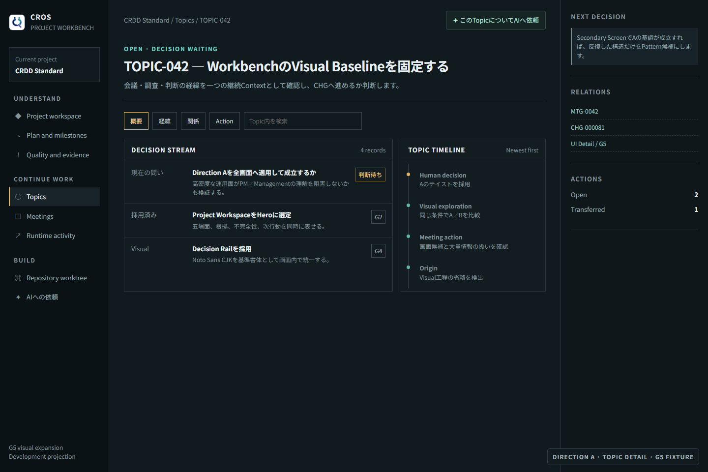
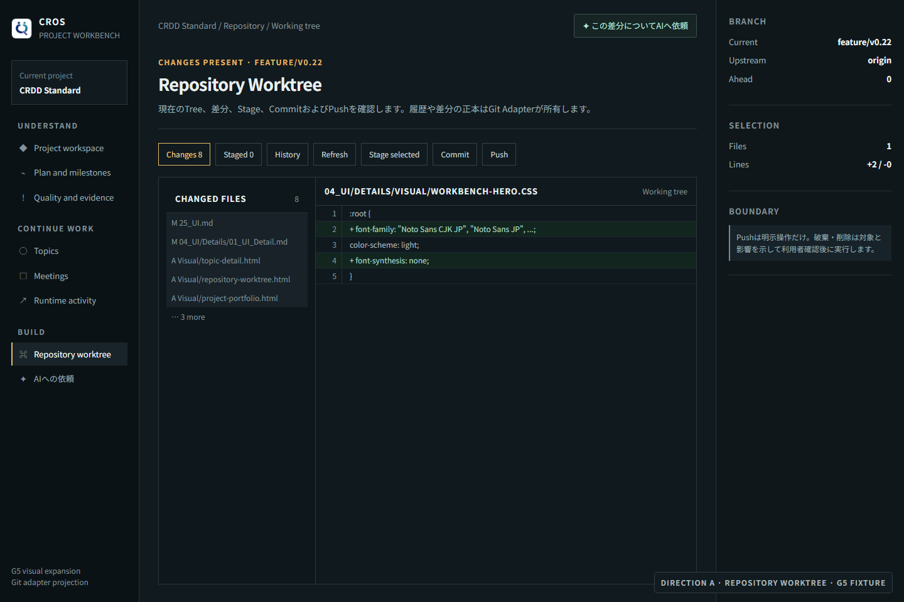
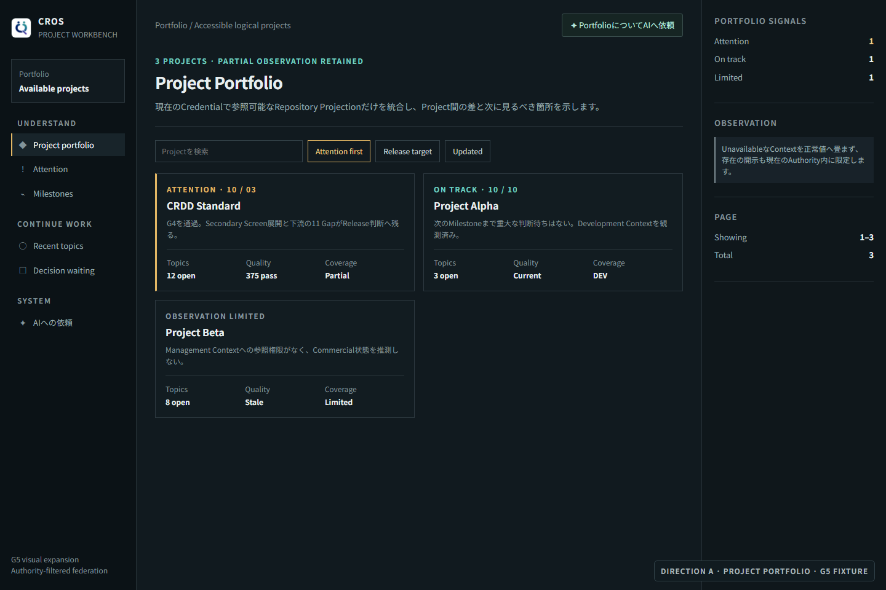

# Workbench Secondary Screen Expansion

状態: Reviewed Draft — G5 Passed

Related:
- [Workbench Screen Architecture](02_Workbench_Screen_Architecture.md)
- [Workbench Hero Screen Selection](03_Workbench_Hero_Selection.md)
- [Workbench Visual Exploration](04_Workbench_Visual_Exploration.md)
- [Workbench Visual Baseline](Visual/workbench-hero/visual-baseline.md)

## 1. 結論

Qual-Labが採用した`A — Decision Rail`を、Hero以外の性質が異なる3画面へ展開した。Topic Detail、Repository Worktree、Project Portfolioのすべてで、暗色、高密度、判断優先、左Navigation、中央作業面、右Evidence Railという基調が成立した。

```text
Project Workspace
        │
        ├─ Topic Detail
        │    経緯・Relation・Action
        │
        ├─ Repository Worktree
        │    Tree・Diff・Stage・Commit・Push
        │
        └─ Project Portfolio
             Project比較・Attention・Observation Boundary
```

反復からPattern候補は確認できた。一方、Reusable ComponentはVisual Fixtureだけで挙動、状態、Keyboard操作およびAccessibility Contractまで確定できないため、この時点では`CMP-*`へ昇格しない。

## 2. 固定した表示条件

| 項目 | 固定値 | 理由 |
|---|---|---|
| Viewport | 1440 × 960 | Heroと同じ比較条件を保つ |
| Visual Direction | A — Decision Rail | G4の人間判断 |
| 基準書体 | Noto Sans CJK JP | 日本語と英数字を高密度画面で統一する |
| 実行環境Fallback | Noto Sans JP → Yu Gothic UI → Hiragino Sans → system-ui | 未導入環境でも情報を失わない |
| 見出し書体 | 本文と同じ | 明朝／Serifとの混在を避ける |
| Code／ID表示 | 同じ書体＋tabular numerals | 画面全体の統一を優先し、固定幅が不可欠な編集面だけDetailで再評価する |
| Type Scale | 12／13／14／16／18／24／30px | 常用本文14px、補助情報12pxを下限にし、密度を文字縮小へ依存させない |
| 操作対象 | Desktop 32px以上 | Touch中心のSurfaceでは44px以上を要求する |
| Fixtureの数値 | 表示検証用 | Current Project Stateの事実主張ではない |

現在のWindows環境では`Noto Sans JP`が導入済みであり、Rendered ViewはFont Stackの第2候補で検証した。配布物へFont Binaryを同梱するかは、UI実装時にライセンス、配布容量、Offline要件および更新Ownerを評価する。

## 3. Secondary Screenの成立確認

| 画面候補 | 主な利用者成果 | A基調の成立 | 固有の変化 | Rendered View |
|---|---|---|---|---|
| Topic Detail | 経緯、判断、Relation、Actionを継続Contextとして理解する | PASS | 中央をDecision Stream＋Timelineに変更 | [PNG](Visual/workbench-hero/topic-detail.png)／[HTML](Visual/workbench-hero/topic-detail.html) |
| Repository Worktree | Tree、Diff、Stage、Commit、Pushの現在状態を理解して安全に操作する | PASS | 中央をTree＋Diffへ変更し、右RailへBranchと破壊操作境界を置く | [PNG](Visual/workbench-hero/repository-worktree.png)／[HTML](Visual/workbench-hero/repository-worktree.html) |
| Project Portfolio | 権限内の複数Projectを比較し、優先して見る対象を選ぶ | PASS | 中央をProject Card Gridへ変更し、欠測を正常値へ畳まない | [PNG](Visual/workbench-hero/project-portfolio.png)／[HTML](Visual/workbench-hero/project-portfolio.html) |

### Topic Detail



### Repository Worktree



### Project Portfolio



## 4. 発見したPattern候補

| Pattern候補 | 反復した画面 | 保持する意味 | 可変部分 | 判定 |
|---|---|---|---|---|
| Decision Rail Shell | 4画面 | 左で場所、中央で仕事、右で根拠・境界・次行動を理解する | 中央CompositionとRailのSection | 採用候補 |
| Screen Context Header | 4画面 | 現在地、状態、目的、AI依頼入口を同じ順で理解する | Eyebrow、Title、説明、Action | 採用候補 |
| Attention Treatment | 4画面 | 判断待ち、日程Risk、未完了を通常状態と区別する | 色、Label、Action | 採用候補 |
| Evidence／Boundary Rail | 4画面 | 根拠、不完全性、Authority、破壊操作境界を仕事の隣で確認する | Section内容 | 採用候補 |
| Collection Control Bar | Topic、Repository、Portfolio | 大量情報を検索・絞り込み・継続読込する | Control群、取得方式 | 採用候補 |

PatternはProduct固有のVisual／Information Ruleであり、直ちに共通Component実装を意味しない。

## 5. CMP昇格判断

| 候補 | 判定 | 理由 | 昇格条件 |
|---|---|---|---|
| Navigation Item | 保留 | Active、Disabled、Restricted、Keyboard操作が未定義 | 状態とAccessibility ContractをSPEC Detailへ接続できる |
| Context Header | 保留 | Actionの有無と狭幅時の振舞いが未定義 | 2以上の実装画面で同一Contractが成立する |
| Attention Item | 保留 | Topic、Quality、PortfolioでAction／Severityが異なる | 共通Propertyと固有Variantを分離できる |
| Evidence Rail Section | 保留 | Disclosure AuthorityとSource種類で開示内容が変わる | Authorityを越えない共通Contractを定義できる |
| Collection Controls | 保留 | Cursor、Page、Lazy Tree等の取得方式が異なる | UI状態とBHVの対応を固定できる |

`CMP-*`未発行は未評価ではない。Visual反復は確認済みだが、早すぎる抽象化を避けるための意図的な保留である。

## 6. 下流への引き渡し

| 下流 | 保持する内容 | 先取りしない内容 |
|---|---|---|
| SPEC Detail | Collection取得、状態、失敗、継続読込、Git操作、Authority別開示 | APIや永続化方式 |
| Architecture | Font配布、描画Surface、Git Adapter、CROS Projection、権限境界 | Frontend Frameworkの選択 |
| Quality | Visual Baseline、情報階層、Keyboard操作、欠測表示、破壊操作確認 | Test Toolの固定 |
| Development | 再現可能なHTML／CSS Fixtureと採用Pattern候補 | FixtureをProduction実装とみなすこと |

## 7. 未確認事項・戻り条件

| 項目 | 状態 | Owner | 現在の影響 | 再評価契機 |
|---|---|---|---|---|
| Font Binary同梱 | OPEN | Architecture／Distribution | Visual BaselineはFont Stackで成立。配布物の再現性は未確定 | Workbench実装方式とOffline要件の決定時 |
| CMP発行 | OPEN | UI Detail | Patternは利用可能。共通Component Contractは未確定 | Secondary ScreenのSPEC Detail完成時 |
| 狭幅表示 | 解決済み | UI Detail／Quality | 320〜1920 CSS pxで3画面を含む5画面を再表示し、横Overflow、12px未満文字、32px未満操作対象はいずれも0件 | Breakpointまたは画面Compositionを変更した時 |
| 実Browser Zoom | 解決済み | UI Detail／Quality | 5画面×100%／200%／400%で実倍率、画像読込、横Overflow、文字下限、操作対象、Focus順および終了後資源を確認した | Source、CSS、Composition、Browser Profile契約または検証器を変更した時 |
| 正式SCR／PRT採番 | OPEN | UI Detail | Screen候補とVisual Patternは確認済み | Detail Contract Freeze時 |

## Checklist

- [x] G4で人間が採用したDirectionだけを展開した
- [x] Heroと性質の異なる3つのSecondary Screenへ展開した
- [x] 全画面を同じViewportで描画した
- [x] Noto Sans CJK系のFont Stackを全画面へ統一適用した
- [x] 見出しと本文で別書体を混在させていない
- [x] 常用本文14px、補助情報12pxを原則下限として適用した
- [x] 文字、余白、Contrast、操作対象、状態識別および狭幅をVisual Design Principleとして評価した
- [x] 画面固有の意味を保ち、HeroのLayoutをそのまま複製していない
- [x] 反復からPattern候補を発見した
- [x] CMP昇格を個別に評価し、未発行理由と再評価条件を記録した
- [x] Fixtureの表示値をCurrent Project Stateの事実主張として扱っていない
- [x] 下流が保持すべき意味と先取りしない実装判断を分けた
